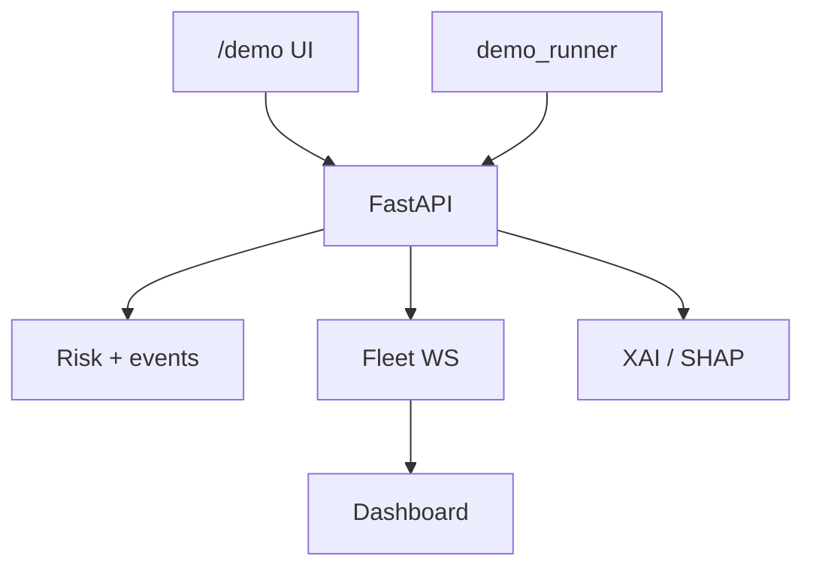

# BMW AI Automotive Intelligence Platform

> A production-grade, full-stack automotive AI platform demonstrating ADAS, Software-Defined Vehicle (SDV), predictive maintenance, and explainable AI capabilities aligned with BMW Group's strategic direction.

## 🚀 Quick Start

### Prerequisites
- Python 3.11+ 
- Node.js 20+
- Docker Desktop 4.x (8GB RAM allocated)
- Git

### Phase 0 Setup (5 minutes)

```bash
# 1. Copy environment file
cp .env.example .env

# 2. Start all services
cd infra
docker compose -f docker-compose.yml up -d

# 3. Wait for services to be healthy
docker compose ps
```

This starts:
- PostgreSQL + TimescaleDB (port 5432)
- Redis (port 6379)
- ChromaDB (port 8001)
- MinIO (port 9000 / 9001)
- FastAPI backend (port 8000)
- Next.js frontend (port 3000)
- MLflow (port 5000)
- Ollama LLM (port 11434)
- Kuksa Databroker (port 55555)
- Prometheus (port 9090)
- Grafana (port 3001)

### Access Points

| Service | URL | Login |
|---------|-----|-------|
| Frontend Dashboard | http://localhost:3000 | N/A |
| API Docs (Swagger) | http://localhost:8000/docs | N/A |
| MLflow Tracking | http://localhost:5000 | N/A |
| MinIO Admin | http://localhost:9001 | minioadmin / minioadmin123 |
| Grafana Monitoring | http://localhost:3001 | admin / admin123 |

## 📊 Project Structure

```
bmw-ai-platform/
├── apps/
│   ├── frontend/           # Next.js 14 React dashboard
│   └── backend/            # FastAPI REST + WebSocket API
├── ml/
│   ├── driver_monitoring/  # Drowsiness, phone usage detection
│   ├── cabin_intelligence/ # Occupancy, child detection
│   ├── road_understanding/ # Segmentation, YOLO/ByteTrack, MiDaS depth
│   ├── predictive_maintenance/  # Component failure forecasting
│   ├── risk_engine/        # Risk scoring aggregation
│   ├── assistant/          # LangGraph RAG agent
│   ├── xai/                # Grad-CAM + SHAP explanations
│   └── training/           # Kaggle/Colab training scripts
├── sdv/                    # Eclipse Kuksa VSS integration
├── infra/                  # Docker Compose + monitoring
└── notebooks/              # Development Jupyter notebooks
```

## 🛠️ Tech Stack

| Layer | Technologies |
|-------|--------------|
| **Frontend** | Next.js 14, React 18, TypeScript, Tailwind CSS, Recharts |
| **Backend** | FastAPI, SQLAlchemy 2.0 async, Celery, Redis |
| **Database** | PostgreSQL 16 + TimescaleDB (time-series) + ChromaDB (vector store) |
| **Computer Vision** | PyTorch, YOLOv8, DeepLabV3+, OpenCV, MediaPipe, Dlib |
| **LLM/RAG** | LangGraph, Ollama (local LLM), Sentence Transformers |
| **XAI** | pytorch-grad-cam, SHAP, Captum |
| **Vehicle SDV** | Eclipse Kuksa Databroker, VSS signals |
| **MLOps** | MLflow, Docker, GitHub Actions |

## 📋 The 10 Modules

| # | Module | Description |
|---|--------|-------------|
| **01** | Driver Monitoring | Real-time drowsiness (EAR), yawning (MAR), head pose, phone/smoking detection |
| **02** | Cabin Intelligence | Seat occupancy detection, child detection, unattended vehicle alerts |
| **03** | Road Understanding | Segmentation, YOLO/ByteTrack, MiDaS depth, HSV traffic lights, Caltech temporal pedestrian localization |
| **04** | Risk Prediction | Modules 4A–4F: weighted risk scoring, YAML overrides, Redis distribution, TTC + event detectors, persistence + MinIO clips, REST/Celery |
| **05** | Driver Behavior | Weekly safety scoring, harsh braking/speeding tracking |
| **06** | Predictive Maintenance | Modules 3A–3I: datasets, engine/brake/battery/tire models, Kuksa I/O, pipeline, API, UI |
| **07** | AI Assistant | LangGraph agent with RAG + live Kuksa telemetry context |
| **08** | Safety Events | Module 4G: live risk & events UI (complete) |
| **09** | Fleet Dashboard | Multi-vehicle real-time monitoring with WebSocket updates (Phase 6A–6E) |
| **10** | Explainable AI | Grad-CAM heatmaps, SHAP panels, NL explanations (Phase 6F–6G) |

## 🎯 Development Roadmap

### Phase 0 — Setup & Database (Days 1–5) ✅ COMPLETE
- Docker environment (12 services)
- SQLAlchemy models + Alembic `001_initial_schema`
- FastAPI `/api/v1/*` router scaffold (REST + WebSocket + SSE)
- Auth (JWT register/login), Redis + Celery stubs
- Next.js landing + dashboard scaffold, CI workflow
- Docs under `docs/`

### Phase 1 — Driver Monitoring (Days 6–22)
- EAR/MAR detection with Dlib
- Head pose estimation with MediaPipe
- YOLO training on DMD dataset (Kaggle)
- WebSocket streaming endpoint

### Phase 2 — Road Understanding (Days 15–28)
- DeepLabV3+ road segmentation on BDD100K
- YOLO road-object detection for box-based downstream modules
- YOLOv8n-LSTM temporal pedestrian localization (Caltech Pedestrian YOLO)
- ByteTrack object tracking
- Pretrained MiDaS relative depth (metric distance requires camera calibration)
- HSV red/amber/green traffic-light state classification
- Unified stateful frame pipeline with partial-failure handling (Module 2G)
- Real JPEG/PNG REST inference and binary-frame WebSocket streaming (Module 2H)
- Live road-camera/upload UI with overlays and pipeline diagnostics (Module 2I)

### Phase 3 — Predictive Maintenance (Days 22–35)
- Local dataset loaders + feature engineering for EVIoT / battery / NEV / logistics (Module 3A)
- NEV fault classifier / engine-health model (Module 3B) — train in local notebook
- XGBoost brake-condition classification on logistics fleet data (Module 3C) — local notebook
- Leakage-safe battery SoH regression on cycle-aging data (Module 3D) — local notebook
- XGBoost tire-wear proxy regression from logistics `TPI` (Module 3E) — local notebook
- Typed Kuksa VSS subscribe/store + deterministic broker-free simulator (Module 3F)
- Unified 3B–3E pipeline with partial failures and native XGBoost SHAP contributions (Module 3G)
- Maintenance REST API + Celery batch task running 3G and persisting per-component predictions with SHAP payloads (Module 3H)
- Responsive `/maintenance` dashboard with component health cards, alerts, persisted trends, telemetry contract editor, and SHAP contributions (Module 3I)

### Phase 4 — Risk Engine & Events (Days 28–40)
- Pure weighted risk scoring core with immutable factor evidence, continuous LOW–CRITICAL bands, and 22 unit tests (Module 4A — complete)
- Safe declarative YAML overrides with auditable evidence and no-downgrade severity floors (Module 4B — complete)
- Redis pub/sub risk distribution to fleet WebSockets (Module 4C — complete): `risk_service` evaluates 4A/4B, caches latest score, publishes `risk:{vehicle_id}`, and `/api/v1/fleet/ws/{org_id}` fans out `risk_update` frames
- TTC + safety event detectors on 1G/2G/3F outputs (Module 4D — complete): `event_detector.py` with near-collision, driver-asleep, unsafe-following, hard-braking, prolonged-phone, and pedestrian-proximity detectors using Module 08 thresholds
- Event persistence with telemetry snapshots, rule-based XAI explanations, and 30 s MinIO video clips (Module 4E — complete): `event_service` + rolling clip buffer + Celery clip retry
- Real risk/events REST endpoints, durable risk history, acknowledge flow, and Celery jobs (Module 4F — complete)
- Live risk gauge fed by fleet WebSocket, persisted risk trends, and acknowledgeable safety event feed with XAI + clip links (Module 4G — complete)

### Phase 5 — AI Assistant (Days 35–50)
- **RAG knowledge base** — PDF/text ingestion → ChromaDB with `all-MiniLM-L6-v2` embeddings (Module 5A — complete)
- **RAG retrieval pipeline** — intent classify → similarity search → cited context / OBD lookup (Module 5B — complete)
- **Ollama assistant agent** — LangGraph-style nodes + RAG/telemetry prompt → `llama3.2:3b` (Module 5C — complete)
- **Assistant REST API** — `POST /api/v1/assistant/chat` (SSE/JSON) + conversation history (Module 5D — complete)
- **Assistant chat UI** — `/assistant` with SSE streaming, citations, and history (Module 5E — complete)
- **Context-aware prompts** — telemetry + predictive maintenance injected into answers (Module 5F — complete)
- **Multi-turn conversation memory** — prior turns loaded into the agent prompt + history reload in UI (Module 5G — complete)

### Phase 6 — Dashboard & XAI (Days 45–62)
- **Fleet APIs + enriched WebSocket** — overview metrics, multi-vehicle seed, `risk:*` / `events:*` / `maintenance:*` fan-out (Module 6A — complete)
- **Fleet overview UI** — `/dashboard` vehicle grid, risk bars, demo Leaflet map (Module 6B — complete)
- **Vehicle detail** — `/dashboard/vehicles/[id]` telemetry charts, events, maintenance, assistant link (Module 6C — complete)
- **Leaderboard + analytics** — real `/analytics/fleet/leaderboard` and incident trends (Module 6D — complete)
- **Alerts center** — `/dashboard/alerts` with ack, clip, and XAI preview (Module 6E — complete)
- **Grad-CAM heatmaps** — EigenCAM/synthetic overlays + heatmap file API (Module 6F — complete)
- **Unified XAI panel** — NL explanations, SHAP plot/ASCII, rule trace (Module 6G — complete)

### Phase 7 — Integration & Demo (Days 60–75) ✅ COMPLETE
- **E2E integration tests** — driver → fleet → XAI → assistant smoke suite (Module 7A — complete)
- **Offline demo runner** — video/synthetic frame replay + risk/events injection (Module 7B — complete)
- **Demo mode UI** — `/demo` start/stop/status + walkthrough (Module 7C — complete)
- **Light JWT auth** — login page, demo user seed, org-scoped fleet reads, write protection in prod (Module 7D — complete)
- **Prod config** — CORS origins, `/ready` probe, env matrix (Module 7E — complete)
- **Cloud deploy** — `Dockerfile.backend`, `render.yaml`, `vercel.json` + [docs/CLOUD_DEPLOY.md](docs/CLOUD_DEPLOY.md) (Module 7F — complete)
- **Docs + CI** — [docs/DEMO.md](docs/DEMO.md), architecture diagram, GitHub Actions lint/typecheck/pytest (Module 7G — complete)

### Phase 8 — Advanced Integration extras (local) ✅
- Captum IG, Kuksa bridge, weight registry, YOLO export, metrics (kept as platform extras)

### Spec Phase 9 — Personalized Role Dashboards ✅ COMPLETE
- **9D** Shared `StatCard` / `TelemetryChart` / `EventList` / `RoleShell`
- **9B** `/fleet/dashboard` (+ analytics/alerts/xai); `/dashboard` redirects
- **9A** `/driver/dashboard` — score, telemetry, events
- **9C** `/admin/dashboard` — invites, roles, audit, health APIs

### Spec Phase 10 — Production Hardening & Observability ✅ COMPLETE
- **10A** Playwright e2e + k6/Locust load scripts ([docs/PHASE10.md](docs/PHASE10.md))
- **10B** Sentry (`SENTRY_DSN`), JSON logging, Prometheus custom metrics, Grafana Phase 10 dashboard
- **10C** Login rate limit (5/min → 429), upload MIME/size checks, secrets vault notes
- **10D** Error envelope, pagination, Idempotency-Key, `/api/v1` stability
- **10E** Audit on event ack + model promote stub

### Spec Phase 11 — ML/AI Maturity & Governance ✅ COMPLETE
- **11A** MLflow/local promote with eval gate ([docs/PHASE11.md](docs/PHASE11.md))
- **11B** PSI drift detection (`/api/v1/ml/drift/check`)
- **11C** Event feedback + retrain CSV export
- **11D** Assistant guardrails + RAGAS-style eval score

### Spec Phase 12 — Notifications & Product Polish ✅ COMPLETE
- **12A** CRITICAL email/SMS (Resend/Twilio) + prefs/webhooks ([docs/PHASE12.md](docs/PHASE12.md))
- **12B** Driver PWA (manifest + service worker)
- **12C** Skip link, ARIA, focus rings, light/dark theme toggle
- **12D** Weekly driver PDF (`/api/v1/analytics/driver/{id}/weekly.pdf`)

### Spec Phase 13 — Performance & Optimization Pass ✅ COMPLETE
- **API/WS** Gzip, analytics Cache-Control, org-filtered + throttled fleet WS ([docs/PHASE13.md](docs/PHASE13.md))
- **Data** Telemetry batch buffer, LTTB downsample, partial unacked indexes, Timescale CAGG SQL
- **Risk/Assistant** Override-first short-circuit; semantic answer cache; Celery `ml_tasks` / `notifications`
- **CV/UI** Adaptive frame sampling + face gate; virtualized fleet grid; memo + dynamic charts

### Spec Section 19 — Advanced Industry Features ✅ COMPLETE
- Compliance TARA + signed OTA + fail-safe ([docs/SECTION19.md](docs/SECTION19.md))
- Edge/cloud routing, OTA canary UI (ONNX export optional — user-provided weights)
- Redpanda profile + Kafka bus wired from risk publish; Feast features on evaluate
- Kalman fusion, multi-agent assistant, FedAvg, digital twin UI
- Helm (backend/frontend/postgres/ingress) + Terraform plan scaffold; chaos probes
- Stripe SDK when `STRIPE_SECRET_KEY` set; insurance + carbon; tenant rate limit; GDPR; password reset
- CDN/presign media URLs, `next/image` MediaThumb, read-replica analytics sessions
- **Module 02** cabin API `POST /api/v1/cabin/analysis` + monitor UI panel
- Email verify / forgot-password / reset-password / Google OAuth / MFA settings UI
- Brotli compression, Timescale CAGG migration `008`, Helm HPA template
- Load/a11y measurement docs: [docs/load/k6_500vu_results.md](docs/load/k6_500vu_results.md), [docs/a11y/lighthouse.md](docs/a11y/lighthouse.md)

## 🎬 Demo walkthrough (Phase 7G)

Full checklist: **[docs/DEMO.md](docs/DEMO.md)**

1. Seed → open `/demo` → Start demo  
2. Fleet `/dashboard` → Safety → vehicle SHAP → Alerts → Grad-CAM → Assistant  
3. Login: `demo@bmwai.dev` / `demo1234` (manager) · viewer `viewer@bmwai.dev` / `viewer1234`



### Cloud URLs (fill after deploy)

| Service | URL |
|---------|-----|
| Frontend (Vercel) | `https://YOUR_APP.vercel.app` |
| API (Render) | `https://YOUR_API.onrender.com` |

Setup: [CLOUD_DEPLOY.md](docs/CLOUD_DEPLOY.md) · [DEPLOYMENT.md](docs/DEPLOYMENT.md)

### Model weights

`yolov8*.pt` and `ml/models/*.pt` are **gitignored**. Cold demo uses synthetic/CPU fallbacks. Optional: `python -c "from ultralytics import YOLO; YOLO('yolov8n.pt')"` or place Kaggle exports under `ml/models/` ([TRAINING.md](docs/TRAINING.md)).

## 🔧 Environment Setup

```bash
# Create .env from template
cp .env.example .env

# The defaults work for local Docker setup:
# - PostgreSQL: bmwai:bmwai_secret @ localhost:5432
# - Redis: localhost:6379
# - Ollama: http://localhost:11434
# - All other services on localhost
```

## 📦 Installing Backend Dependencies

```bash
cd apps/backend
pip install -r requirements.txt
```

### Phase 5A — RAG knowledge base (optional)

```bash
pip install -r apps/backend/requirements-rag.txt
python scripts/build_knowledge_base.py --reset
```

This ingests `data/bmw_owner_manual.txt`, `data/obd2_codes.txt`, and `data/service_intervals.txt` into local `chroma_db/` using `all-MiniLM-L6-v2` embeddings. On Windows (without MSVC), indexing uses a local JSON vector store automatically; use `--http` with Docker Chroma for a server-backed index.

### Phase 5B — retrieve cited context (no LLM)

```bash
python scripts/demo_rag_retrieval.py
python scripts/demo_rag_retrieval.py "Why is my TPMS warning on?"
```

### Phase 5C — ask the assistant (Ollama)

```bash
# Optional but recommended for real LLM answers:
ollama serve
ollama pull llama3.2:3b

python scripts/demo_assistant_5c.py
python scripts/demo_assistant_5c.py "What does P0420 mean?"
```

If Ollama is not running, the demo still works with an offline fallback answer grounded in RAG context.

### Phase 5D — assistant HTTP API

With the backend running:

```bash
# JSON response
curl -X POST http://localhost:8000/api/v1/assistant/chat ^
  -H "Content-Type: application/json" ^
  -d "{\"message\":\"Why is my TPMS warning on?\",\"stream\":false,\"persist\":false}"

# SSE stream (default)
curl -N -X POST http://localhost:8000/api/v1/assistant/chat ^
  -H "Content-Type: application/json" ^
  -d "{\"message\":\"What does P0420 mean?\",\"stream\":true}"
```

Open the UI at [http://localhost:3000/assistant](http://localhost:3000/assistant). Selecting a past conversation reloads its messages; follow-ups reuse that thread as Module 5G memory.

## 📦 Installing Frontend Dependencies

```bash
cd apps/frontend
pnpm install
```

## 🧪 Running Tests

```bash
# Backend — full suite (CI uses Postgres + Redis services)
cd apps/backend
pytest tests/ -v

# Faster local smoke (skips Module 7A integration marker)
pytest tests/ -m "not integration" -v

# Demo runner unit tests
cd ../..
pytest ml/demo/tests/ -v

# Frontend
cd apps/frontend
npm run lint
npm run type-check
```

## 🚀 Running the Project Locally (Without Docker)

### Terminal 1 — PostgreSQL + Redis (via Docker)
```bash
docker run -d \
  -e POSTGRES_USER=bmwai \
  -e POSTGRES_PASSWORD=bmwai_secret \
  -e POSTGRES_DB=bmwai_db \
  -p 5432:5432 \
  timescale/timescaledb:latest-pg16

docker run -d -p 6379:6379 redis:7-alpine
```

### Terminal 2 — FastAPI Backend
```bash
cd apps/backend
uvicorn app.main:app --reload --port 8000
```

### Terminal 3 — Next.js Frontend
```bash
cd apps/frontend
pnpm dev
```

### Terminal 4 — Ollama LLM
```bash
ollama serve
```

Then pull the 3B LLM:
```bash
ollama pull llama3.2:3b
```

## 📚 Training Models on Kaggle

All ML training happens on **Kaggle Free GPU** (P100/T4) to keep costs at $0.

1. Create Kaggle account + enable GPU
2. Upload datasets (DMD, BDD100K, Caltech Pedestrian YOLO)
3. Create notebooks from `notebooks/train_*.py` scripts
4. Download trained `.pt` weights to `ml/models/`

See [TRAINING.md](docs/TRAINING.md) for detailed instructions.

## 🌐 Deployment

**Production** (estimated **$7–15/month**):
- Frontend: Vercel (free)
- Backend: Render ($7/month)
- Database: Render Postgres (1GB free)
- Redis: Upstash (free tier)
- Storage: Cloudflare R2 (10GB free)

See [DEPLOYMENT.md](docs/DEPLOYMENT.md) for full cloud setup.

## 📖 Documentation

- [Demo checklist](docs/DEMO.md)
- [Cloud acceptance (8G)](docs/CLOUD_ACCEPTANCE.md)
- [Architecture](docs/architecture.md)
- [API Reference](docs/api.md)
- [Database Schema](docs/database.md)
- [Training Guide](docs/TRAINING.md)
- [Deployment Guide](docs/DEPLOYMENT.md)
- [Cloud deploy (Render + Vercel)](docs/CLOUD_DEPLOY.md)

## 🎓 Learning Resources

| Technology | Resource |
|-----------|----------|
| FastAPI | https://fastapi.tiangolo.com/tutorial/ |
| SQLAlchemy 2.0 | https://docs.sqlalchemy.org/20/orm/quickstart.html |
| YOLOv8 | https://github.com/ultralytics/ultralytics |
| LangGraph | https://python.langchain.com/docs/langgraph/ |
| Next.js 14 | https://nextjs.org/learn |
| Dlib | http://dlib.net/python/index.html |
| MediaPipe | https://mediapipe.dev/ |
| Eclipse Kuksa | https://github.com/eclipse-kuksa/kuksa-databroker |

## 📝 Contributing

1. Create a feature branch: `git checkout -b feature/your-feature`
2. Make changes
3. Run tests: `pytest` + `pnpm lint`
4. Commit: `git commit -am 'Add feature'`
5. Push and open a PR

## 📄 License

© 2026 BMW AI Platform. Built for educational and portfolio purposes.

---

**Built to demonstrate production-grade automotive AI engineering aligned with BMW Group's strategic direction: Software-Defined Vehicle (SDV), ADAS, Predictive Analytics, and Responsible AI under EU AI Act compliance.**
