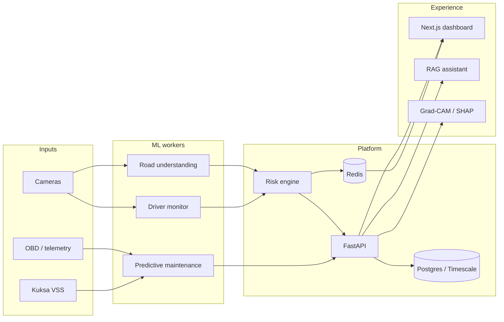

# Architecture Overview

The BMW AI Platform follows a layered architecture:

1. **Input** — Camera feeds, Eclipse Kuksa VSS signals, OBD-II  
2. **CV / maintenance workers** — YOLOv8, MediaPipe, Dlib, XGBoost (Phases 1–3)  
3. **Risk engine** — Weighted scoring + Redis pub/sub (Phase 4)  
4. **FastAPI** — REST + WebSocket + SSE  
5. **Data** — PostgreSQL/TimescaleDB, Redis, ChromaDB, MinIO  
6. **Dashboard** — Next.js 14 fleet / safety / demo (Phase 6–7)  
7. **AI assistant** — LangGraph-style RAG + Ollama (Phase 5)  
8. **XAI** — Grad-CAM + SHAP (Phase 6)

## Demo / cloud path (Phase 7)

| Path | Role |
|------|------|
| `ml/demo/demo_runner.py` | Offline synthetic/video → analysis → risk/events |
| `/demo` UI | Operator start/stop against live API |
| Render (`Dockerfile.backend`) | Production API |
| Vercel (`apps/frontend`) | Production UI |

See [DEMO.md](DEMO.md) and [CLOUD_DEPLOY.md](CLOUD_DEPLOY.md) / [CLOUD_ACCEPTANCE.md](CLOUD_ACCEPTANCE.md).

## Phase 8 additions

- Captum Integrated Gradients on vision explain (`attribution=ig|both`)
- Live Kuksa bridge API feeding telemetry GPS into the fleet map
- `/metrics` for Prometheus; role matrix viewer vs operator

